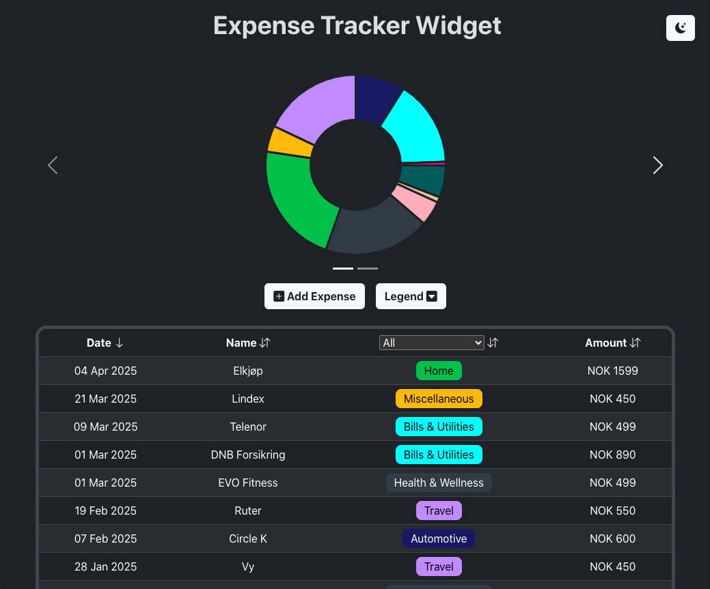

# expense-tracker-widget
A responsive Expense Tracker Widget where users can add, view, and categorize expenses.

## Screenshot



## Project Setup

Navigate to server folder:
```sh
npm install
```
Then, navigate to client folder:
```sh
npm install
```
Go to project folder:
```sh
npm install
```
```sh
npm run dev
```

## Built with

- React - frontend javascript framework
- Tanstack - querying and displaying table
- Chart.js - displaying pie chart and line graph coming soon 
- Bootstrap CSS - styling

## Questions

If you have any questions about the repo, open an issue or contact me directly at brunorosamedia@gmail.com. You can find more of my work at [Barosa19](https://github.com/barosa19).